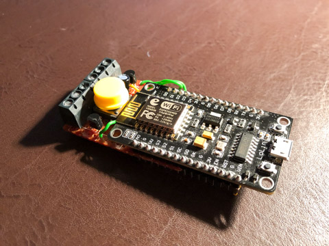
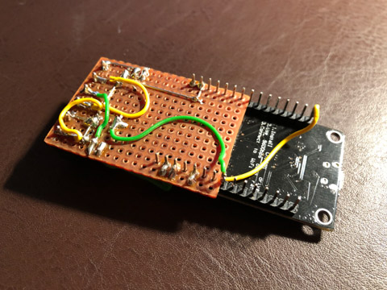

# Circuit

Beware this is a prototype. I am still not happy with this setup, but hey it works! **Don't use this schematic  if you are not familiar with basic circuits!**

This circuit is built from parts that I still own. So if I would do it from scratch I would not use the NPN-Transistor setup that is based on the power limitation function of the ESP! 

## How to use

* Open the [smart-backlight.fzz](./smart-backlight.fzz) with fritzing. (Fritzing is an open-source circuit design software, see [projects website](https://fritzing.org))
* Import the [Node MCU fritzing part](https://github.com/roman-minyaylov/nodemcu-v3-fritzing) from roman-minyaylov 
* Open the Schematic and have a look at it
* Open the PCB - this looks a little bit weird because I use a development PCB and air wiring (see pictures).

## Pictures of the PCBs front and rear

